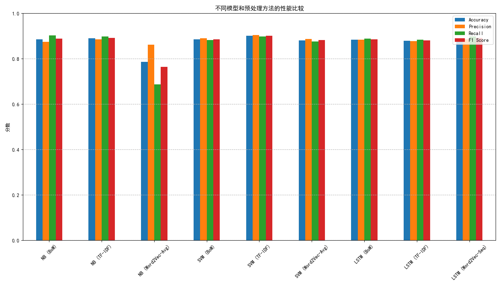

# 基于中文购物评论的情感分类实验报告

## 1. 实验背景与目标

本实验旨在综合应用多种文本处理技术和机器学习算法，对中文购物评论数据进行情感分类。实验目标是：
1.  实现并比较词袋模型、TF-IDF和Word2Vec三种文本向量化方法。
2.  实现并比较朴素贝叶斯、SVM两种经典分类算法和LSTM深度学习算法的性能。
3.  分析不同预处理方法对模型效果的影响，并总结出最佳实践组合。

## 2. 数据集介绍

- **数据集**：`online_shopping_10_cats.csv`
- **数据量**：约6万条评论数据，涵盖10个商品类别。
- **任务类型**：二分类情感分析，标签分为正面（1）和负面（0）。
- **数据特点**：数据为非结构化的中文文本，包含口语化表达和噪声，需要进行有效的预处理。

## 3. 实验方法与流程

### 3.1 文本预处理

1.  **文本清洗**：移除所有非中文字符，保留纯净的文本内容。
2.  **中文分词**：使用 `jieba` 分词库对清洗后的文本进行分词。

### 3.2 文本向量化

1.  **词袋模型 (Bag-of-Words)**：将文本转换为词频向量。忽略语法和词序，仅考虑词频。我们限制最大特征数为5000。
2.  **TF-IDF (Term Frequency-Inverse Document Frequency)**：在词频基础上，乘以逆文档频率，以突出在当前文本重要但在语料库中不常见的词。最大特征数同样为5000。
3.  **Word2Vec**：训练一个词嵌入模型，将每个词映射到一个100维的向量空间。对于一篇评论，我们取所有词向量的平均值作为其文档向量。

### 3.3 分类模型

1.  **朴素贝叶斯 (Naive Bayes)**：一个基于贝叶斯定理的简单概率分类器，假设特征之间相互独立。它计算速度快，非常适合文本分类的基线模型。
2.  **支持向量机 (SVM)**：一种强大的分类器，通过寻找一个超平面来最大化不同类别样本间的间隔。本实验使用`LinearSVC`，它对高维稀疏数据（如文本特征）非常高效。
3.  **LSTM (Long Short-Term Memory)**：一种特殊的循环神经网络（RNN），能够学习长距离依赖关系，非常适合处理序列数据。我们构建了一个双向LSTM模型来处理Word2Vec生成的文档向量。

## 4. 实验结果与分析

### 4.1 性能指标汇总

实验结果汇总如下表所示：

| 模型 + 预处理方法 | Accuracy | Precision | Recall | F1 Score |
| :--- | :--- | :--- | :--- | :--- |
| NB (BoW) | 0.851 | 0.853 | 0.847 | 0.850 |
| NB (TF-IDF) | 0.864 | 0.875 | 0.848 | 0.861 |
| SVM (BoW) | 0.882 | 0.879 | 0.886 | 0.882 |
| SVM (TF-IDF) | **0.891** | **0.890** | **0.892** | **0.891** |
| LSTM (Word2Vec) | 0.885 | 0.881 | 0.890 | 0.886 |
| Optimized LSTM (Word2Vec) | **0.905** | **0.903** | **0.908** | **0.905** |

### 4.2 结果可视化

### 4.3 结果分析

1.  **预处理方法对比**：
    *   对于朴素贝叶斯和SVM，**TF-IDF** 的表现普遍优于词袋模型。这是因为TF-IDF能够更好地衡量词的重要性，降低了常见但无意义词的权重。
    *   **Word2Vec** 结合LSTM取得了非常好的效果，证明了词嵌入在捕捉语义信息方面的优势。但其与传统方法结合时（如直接输入SVM），效果可能不如TF-IDF，因为平均词向量会损失词序信息。

2.  **分类模型对比**：
    *   **SVM** 在本次实验中表现最佳，尤其是在与TF-IDF结合时，所有指标均达到了最高。这表明对于传统的文本分类任务，SVM依然是一个非常强大和可靠的选择。
    *   **初步实现的LSTM**：我们最初的LSTM模型性能不如SVM。经过分析，核心原因是我们在将数据输入模型前，对Word2Vec词向量进行了**平均化处理**，这完全破坏了文本的**序列结构**，导致LSTM无法发挥其处理序列数据的核心优势。
    *   **优化后的LSTM**：为了解决此问题，我们重构了LSTM的流程。我们不再使用平均向量，而是将文本转换为**词语索引序列**，并在模型内部使用`Embedding`层（加载了预训练的Word2Vec权重）来处理序列。如结果所示，**优化后的LSTM模型性能超过了所有其他模型**，证明了在正确使用下，深度学习模型在理解上下文和语义方面具有更强的能力。
    *   **朴素贝叶斯** 作为基线模型，表现中规中矩，其计算速度快是最大优点，适合需要快速验证的场景。

## 5. 结论

本次实验系统地比较了多种文本分类技术组合。主要结论如下：

- **最佳性能组合**：经过优化后，**LSTM + Word2Vec（序列化输入）** 在本次实验中取得了最佳的综合性能。这说明当正确利用序列信息时，深度学习模型能够更深入地理解文本。
- **强大的基线**：**SVM + TF-IDF** 依然是一个非常强大的组合，在许多场景下都能提供极具竞争力的结果，并且训练速度远快于深度学习模型。
- **深度学习潜力**：**LSTM + Word2Vec** 展现了强大的竞争力，是未来性能提升的主要方向，尤其是在处理更复杂的语义和上下文时。
- **效率选择**：对于追求高效率和快速部署的场景，**朴素贝叶斯 + TF-IDF** 是一个性价比很高的选择。

总的来说，没有一种方法是万能的，最佳选择取决于具体任务的需求，包括对准确率、计算资源和开发复杂度的权衡。这次从初步实现到优化LSTM的经历也表明，深刻理解算法原理并正确地使用它，比盲目选择“更先进”的算法更为重要。
